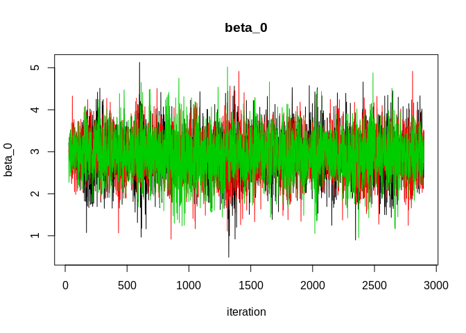
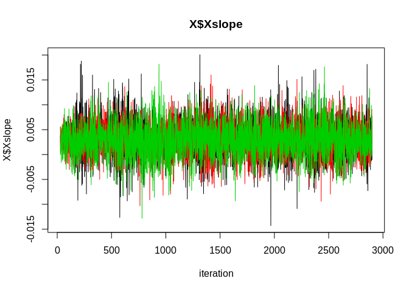
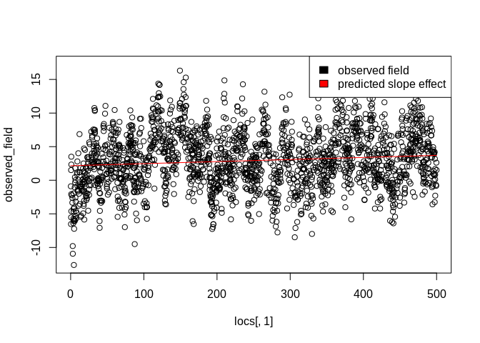
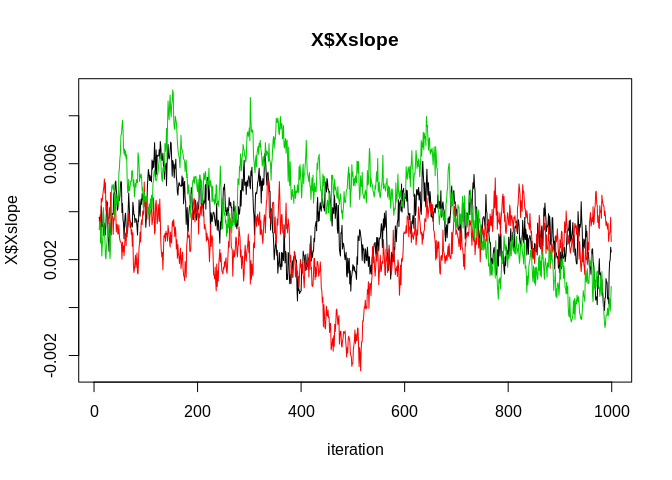

This document is a vignette for the supplementary material of *Two MCMC
Strategies for Nearest Neighbor Gaussian Processes*. The plan is the
following :

-   Create a small synthetic toy example

-   Initialize a model to analyze this toy example and familiarize with
    the objects that are created

-   Run the model, monitor convergence

-   Estimate the parameters

-   Predict the latent field and fix effects

-   Highlight the importance of interweaving with a bad regressor
    parametrization of the same toy example

Toy example creation
====================

Let’s start by creating a 1-dimension toy example

``` r
# let's set a seed...
set.seed(1)
# let's sample some spatial locations
locs = cbind(500*runif(2000), 1) # note that the second dimension does not move ! 
locs[1, 2] = 1.01 # actually, we have to change one point of the second dimension otherwise the nearest neighbor algorithms do not work
# let's sample a random field with exponential covariance
field = sqrt(10)* t(chol(GpGp::exponential_isotropic(c(1, 5, 0), locs)))%*%rnorm(2000)
# let's visualize the field
plot(locs[,1], field, main = "latent field")
```


``` r
# let's add a fix effect
X = matrix(c(locs[,1], rnorm(2000)), ncol = 2) # the first regressor actually is equal to the spatial location
colnames(X) = c("slope", "white_noise")
beta = c(.01, rnorm(1)) #  simulate beta
beta_0 = rnorm(1) # add an intercept
#let's plot the fix effects
plot(locs[,1], X%*%beta + beta_0, main = "fix effects")
```


``` r
# let's add noise with variance 5
noise = sqrt(5) * rnorm(2000)
plot(locs[,1], noise, main = "noise")
```


``` r
# let's combine the latent field, the fix effect, and the Gaussian noise
observed_field = c(as.matrix(field+noise+ X%*%beta + beta_0))
plot(locs[,1], observed_field, main = "observed field")
```


Initialization
==============

How to initialize a model ?
---------------------------

Now, let’s do the setup to work on the toy example. We will use
mcmc\_nngp\_initialize, a function that takes the observed data, Vecchia
approximation, and the specified covariance model as arguments and
outputs a big list with necessary information to run the model. The
initial chain states are guessed using the size of the domain
(covariance range), the variance of the signal (covariance scale and
noise variance), a naive OLS of the observed signal on the regressors
(fix effects of the models), and a perturbation is added in order to
overdisperse the starting points for Gelman-Rubin-Brooks diagnostics.
The list is generated using various arguments :

-   The covariance model of the latent field. The (stationary)
    covariance function is indicated with a string. The stationary
    functions of the GpGp package are used.

-   The Vecchia approximation design. The maxmin order is always used
    for locations ordering. the number of neighbors m is set to 10 by
    default but can be changed. If needed, the reference set can be
    restricted to a certain number of obervations using
    n\_reference\_set.

-   Regressors. Two types of regressors can be provided : X\_obs and
    X\_locs. The first can vary within a spatial location, while the
    second cannot : for example, smoking or alchool consumption can vary
    between the members of a household, while asbestos contamination
    cannot. The formers can only be passed as X\_obs, while the latter
    can be passed as X\_locs or X\_obs. The format is data.frame.
    Passing the regressor at the same time in the two slots will cause
    problems. When it is possible, a regressor should be apssed as
    X\_locs, we will see why later.

-   A seed, set to 1 if not precised

``` r
source("Scripts/mcmc_nngp_initialize.R")
source("Scripts/Coloring.R")
# Now, let's initialize the list. This creates the chains, guesses the initial states, does the Nearest Neighbor search for NNGP, etc.... 
mcmc_nngp_list = mcmc_nngp_initialize(observed_locs = locs, observed_field = observed_field, 
                                            stationary_covfun = "exponential_isotropic", 
                                            X_locs = as.data.frame(X), X_obs = NULL,
                                            m = 5,  
                                            seed = 1)
```

    ## [1] "Setup done, 1.38074946403503 s elapsed"

What is there in the list we just created ?
-------------------------------------------

This section explores the object mcmc\_vecchia\_list we just created in
order to familiarize with the objects that are stored in it.

### Some (reordered, without duplicate) spatial locations

mcmc\_nngp\_list$observed\_locs is the set of locations given as an
input. It can have duplicates. mcmc\_nngp\_list$locs is the set of
spatial locations with no duplicates. It is reordered using the Maxmin
order (see Guinness, *Permutation and grouping methods for sharpening
Gaussian process approximations*)

``` r
head(mcmc_nngp_list$observed_locs)
```

    ##          [,1] [,2]
    ## [1,] 132.7543 1.01
    ## [2,] 186.0619 1.00
    ## [3,] 286.4267 1.00
    ## [4,] 454.1039 1.00
    ## [5,] 100.8410 1.00
    ## [6,] 449.1948 1.00

``` r
head(mcmc_nngp_list$locs)
```

    ##           [,1] [,2]
    ## [1,] 473.98318    1
    ## [2,] 322.15788    1
    ## [3,] 497.64053    1
    ## [4,] 261.23064    1
    ## [5,]  17.08532    1
    ## [6,] 212.43027    1

### Regressors and various objects extracted from them

mcmc\_vecchia\_list$X contains various information about the fix effects
design.

mcmc\_vecchia\_list$X$X is the combination of X\_obs and X\_locs, but it
is not reordered like locs and there can be duplicates. it is centered.

mcmc\_vecchia\_list$X$X\_means indicates the means of the original
regressors, in order to re-transform the regression coefficients samples
once the model is fit. This allows to estimate the regression
coefficients and the effect of the covariates on the signal.

mcmc\_nngp\_list$X$locs indicates which columns of X come from X\_locs.
In our case, since no X\_locs was given, it indicates all the columns of
X.

The rest of the elements are pre-computed cross-products that are used
in the model fitting

``` r
head(mcmc_nngp_list$X$X)
```

    ##           slope white_noise
    ## [1,] -114.74263   0.7407856
    ## [2,]  -61.43501   0.3882794
    ## [3,]   38.92972   1.2980678
    ## [4,]  206.60693  -0.8018877
    ## [5,] -146.65600  -1.6009550
    ## [6,]  201.69788   0.9349216

### Information about the covariance model

mcmc\_nngp\_list$space\_time\_model gives info about the covariance
function, its parameters, their hyperpriors.

``` r
print(mcmc_nngp_list$space_time_model)
```

    ## $response_model
    ## [1] "Gaussian"
    ## 
    ## $covfun
    ## $covfun$stationary_covfun
    ## [1] "exponential_isotropic"
    ## 
    ## $covfun$shape_params
    ## [1] "log_range"

### The design of Vecchia approximation

mcmc\_nngp\_list$vecchia\_approx gives info about the Vecchia
approximation design, the reordering of locations, and some
miscellaneaous stuff such as the number of spatial locations and useful
shorthands.

#### The Nearest Neighbor Array (NNarray) that defines Vecchia approximation’s Directed Acyclic Graph, and some shorthands directly derived from it.

``` r
# Nearest Neighbor Array
head(mcmc_nngp_list$vecchia_approx$NNarray) 
```

    ##      [,1] [,2] [,3] [,4] [,5] [,6]
    ## [1,]    1   NA   NA   NA   NA   NA
    ## [2,]    2    1   NA   NA   NA   NA
    ## [3,]    3    1    2   NA   NA   NA
    ## [4,]    4    2    1    3   NA   NA
    ## [5,]    5    4    2    1    3   NA
    ## [6,]    6    4    2    5    1    3

``` r
# indicator of the non-NA coefficients in NNarray
head(mcmc_nngp_list$vecchia_approx$NNarray_non_NA) 
```

    ##      [,1]  [,2]  [,3]  [,4]  [,5]  [,6]
    ## [1,] TRUE FALSE FALSE FALSE FALSE FALSE
    ## [2,] TRUE  TRUE FALSE FALSE FALSE FALSE
    ## [3,] TRUE  TRUE  TRUE FALSE FALSE FALSE
    ## [4,] TRUE  TRUE  TRUE  TRUE FALSE FALSE
    ## [5,] TRUE  TRUE  TRUE  TRUE  TRUE FALSE
    ## [6,] TRUE  TRUE  TRUE  TRUE  TRUE  TRUE

``` r
 # the column indices in the Vecchia factor = the non-NA entries of NNarray
print(mcmc_nngp_list$vecchia_approx$sparse_chol_column_idx[1:100])
```

    ##   [1]   1   2   3   4   5   6   7   8   9  10  11  12  13  14  15  16  17  18
    ##  [19]  19  20  21  22  23  24  25  26  27  28  29  30  31  32  33  34  35  36
    ##  [37]  37  38  39  40  41  42  43  44  45  46  47  48  49  50  51  52  53  54
    ##  [55]  55  56  57  58  59  60  61  62  63  64  65  66  67  68  69  70  71  72
    ##  [73]  73  74  75  76  77  78  79  80  81  82  83  84  85  86  87  88  89  90
    ##  [91]  91  92  93  94  95  96  97  98  99 100

``` r
# the row indices in the Vecchia factor = the row indices of the non-NA entries of NNarray
print(mcmc_nngp_list$vecchia_approx$sparse_chol_row_idx[1:100]) 
```

    ##   [1]   1   2   3   4   5   6   7   8   9  10  11  12  13  14  15  16  17  18
    ##  [19]  19  20  21  22  23  24  25  26  27  28  29  30  31  32  33  34  35  36
    ##  [37]  37  38  39  40  41  42  43  44  45  46  47  48  49  50  51  52  53  54
    ##  [55]  55  56  57  58  59  60  61  62  63  64  65  66  67  68  69  70  71  72
    ##  [73]  73  74  75  76  77  78  79  80  81  82  83  84  85  86  87  88  89  90
    ##  [91]  91  92  93  94  95  96  97  98  99 100

#### A sparseMatrix objects that stores the adjacency matrix of the Markov graph that is induced by Vecchia approximation.

Is tis obtained by moralization of the Vecchia Directed Acyclic Graph.
It will be used for chromatic sampling.

``` r
print(mcmc_nngp_list$vecchia_approx$MRF_adjacency_mat[1:30, 1:30]) 
```

    ## 30 x 30 sparse Matrix of class "dgCMatrix"
    ##                                                                  
    ##  [1,] 1 1 1 1 1 1 1 1 1 1 1 . . . . . . . . 1 . . . 1 . . . . . .
    ##  [2,] 1 1 1 1 1 1 1 1 1 1 1 1 1 . 1 1 . . . . . . 1 . . 1 . . . .
    ##  [3,] 1 1 1 1 1 1 . 1 1 1 . . . . . . . . . . . . . . . . . . . .
    ##  [4,] 1 1 1 1 1 1 1 1 1 . 1 1 1 1 . . . 1 . . . . 1 . . 1 . . . .
    ##  [5,] 1 1 1 1 1 1 1 . . . . . 1 1 . . 1 1 1 . 1 . . . . . . 1 . .
    ##  [6,] 1 1 1 1 1 1 1 1 1 . . . 1 1 . . 1 1 1 . . 1 1 . 1 . 1 . . .
    ##  [7,] 1 1 . 1 1 1 1 . 1 . . . 1 1 . . 1 1 1 . . 1 . . 1 . 1 . 1 .
    ##  [8,] 1 1 1 1 . 1 . 1 1 1 1 1 . . 1 1 . . . 1 . . . 1 . . . . . .
    ##  [9,] 1 1 1 1 . 1 1 1 1 1 1 1 1 . 1 1 . . . . . . 1 . . 1 . . . .
    ## [10,] 1 1 1 . . . . 1 1 1 1 . . . . . . . . 1 . . . 1 . . . . . .
    ## [11,] 1 1 . 1 . . . 1 1 1 1 1 . . 1 1 . . . 1 . . . 1 . . . . . .
    ## [12,] . 1 . 1 . . . 1 1 . 1 1 . . 1 1 . . . 1 . . 1 . . 1 . . . .
    ## [13,] . 1 . 1 1 1 1 . 1 . . . 1 1 . . 1 1 1 . . 1 1 . . . 1 . . .
    ## [14,] . . . 1 1 1 1 . . . . . 1 1 . . 1 1 1 . 1 1 . . 1 . . 1 . 1
    ## [15,] . 1 . . . . . 1 1 . 1 1 . . 1 1 . . . 1 . . . . . . . . . .
    ## [16,] . 1 . . . . . 1 1 . 1 1 . . 1 1 . . . 1 . . . . . 1 . . . .
    ## [17,] . . . . 1 1 1 . . . . . 1 1 . . 1 1 1 . 1 . . . . . . 1 . .
    ## [18,] . . . 1 1 1 1 . . . . . 1 1 . . 1 1 1 . 1 1 . . 1 . 1 . 1 .
    ## [19,] . . . . 1 1 1 . . . . . 1 1 . . 1 1 1 . 1 1 . . 1 . . 1 1 1
    ## [20,] 1 . . . . . . 1 . 1 1 1 . . 1 1 . . . 1 . . . 1 . . . . . .
    ## [21,] . . . . 1 . . . . . . . . 1 . . 1 1 1 . 1 1 . . 1 . . 1 . 1
    ## [22,] . . . . . 1 1 . . . . . 1 1 . . . 1 1 . 1 1 . . 1 . 1 1 1 1
    ## [23,] . 1 . 1 . 1 . . 1 . . 1 1 . . . . . . . . . 1 . . 1 . . . .
    ## [24,] 1 . . . . . . 1 . 1 1 . . . . . . . . 1 . . . 1 . . . . . .
    ## [25,] . . . . . 1 1 . . . . . . 1 . . . 1 1 . 1 1 . . 1 . 1 1 1 .
    ## [26,] . 1 . 1 . . . . 1 . . 1 . . . 1 . . . . . . 1 . . 1 . . . .
    ## [27,] . . . . . 1 1 . . . . . 1 . . . . 1 . . . 1 . . 1 . 1 . 1 .
    ## [28,] . . . . 1 . . . . . . . . 1 . . 1 . 1 . 1 1 . . 1 . . 1 . 1
    ## [29,] . . . . . . 1 . . . . . . . . . . 1 1 . . 1 . . 1 . 1 . 1 .
    ## [30,] . . . . . . . . . . . . . 1 . . . . 1 . 1 1 . . . . . 1 . 1

#### Vector/Lists of indices that put in relation the observed, possibly redundant observed\_locs and the reordered, non-redundant locs.

The first one is a vector that matches the rows of observed\_locs with
the rows of locs. It allows to use locs to recreate observed\_locs (see
below). Its length is equal to the number of rows of
mcmc\_nngp\_list$observed\_locs and its values range from 1 to the
number of rows of mcmc\_nngp\_list$locs. This means that there are
potentially redundant indices in this vector (if and only if redundant
spatial locations are observed).

``` r
print(mcmc_nngp_list$vecchia_approx$locs_match[1:100])
```

    ##   [1] 1776 1963  243  144  480 1076  182 1861  247 1487  223  674 1391 1548 1065
    ##  [16]  131 1883 1956  767 1072  573 1196 1540  232 1703 1476 1583 1937  114 1765
    ##  [31]  613  246 1185  789 1672 1759 1517 1695 1735 1319  775 1395 1441  530  599
    ##  [46] 1159  526  249  739 1157 1112 1815  334   30 1808 1444  224  928  955 1588
    ##  [61]   79  371  291  233  284 1125  178  528 1271  401  584  890  385  831  346
    ##  [76] 1017  451 1134  317 1767 1738 1266  834 1892 1775   63  406 1398 1821 1717
    ##  [91] 1172  931  697  764 1369  927 1245 1754  897 1721

``` r
head(mcmc_nngp_list$observed_locs)
```

    ##          [,1] [,2]
    ## [1,] 132.7543 1.01
    ## [2,] 186.0619 1.00
    ## [3,] 286.4267 1.00
    ## [4,] 454.1039 1.00
    ## [5,] 100.8410 1.00
    ## [6,] 449.1948 1.00

``` r
head(mcmc_nngp_list$locs[mcmc_nngp_list$vecchia_approx$locs_match,])
```

    ##          [,1] [,2]
    ## [1,] 132.7543 1.01
    ## [2,] 186.0619 1.00
    ## [3,] 286.4267 1.00
    ## [4,] 454.1039 1.00
    ## [5,] 100.8410 1.00
    ## [6,] 449.1948 1.00

The second one is a list of vectors that matches the rows of locs to the
rows of observed\_locs. It is a list and not a vector because there can
be duplicates in observed\_locs, so various rows of observed\_locs can
be matched to the same row of locs. As a result, the list’s length is
the same as the number of rows of locs, but the sum of the lengths of
the elements is equal to the number of rows of observed\_locs. Its
(difficult to pronounce) name is the reverse of the first index vector
name : locs\_match \|\| hctam\_scol

``` r
# It's a list
print(mcmc_nngp_list$vecchia_approx$hctam_scol[1:10])
```

    ## $`1`
    ## [1] 214
    ## 
    ## $`2`
    ## [1] 177
    ## 
    ## $`3`
    ## [1] 1818
    ## 
    ## $`4`
    ## [1] 911
    ## 
    ## $`5`
    ## [1] 1862
    ## 
    ## $`6`
    ## [1] 1855
    ## 
    ## $`7`
    ## [1] 1687
    ## 
    ## $`8`
    ## [1] 1149
    ## 
    ## $`9`
    ## [1] 1389
    ## 
    ## $`10`
    ## [1] 109

The third is a vector obtained by selecting only the first element of
each vector of the previous list. It allows to recreate locs from
observed\_locs. It has the same length as locs.

``` r
print(mcmc_nngp_list$vecchia_approx$hctam_scol_1[1:100])
```

    ##    1    2    3    4    5    6    7    8    9   10   11   12   13   14   15   16 
    ##  214  177 1818  911 1862 1855 1687 1149 1389  109  251  502 1070  156  580  735 
    ##   17   18   19   20   21   22   23   24   25   26   27   28   29   30   31   32 
    ## 1944  259  534  714  461 1067 1537 1154  618  585  556 1974  113   54  754  755 
    ##   33   34   35   36   37   38   39   40   41   42   43   44   45   46   47   48 
    ## 1436 1330  400  183 1738 1254  974 1659  423  915 1883 1472  796  322  951 1134 
    ##   49   50   51   52   53   54   55   56   57   58   59   60   61   62   63   64 
    ##  614 1563 1242  857  270 1863 1051 1803 1466 1725 1269  927 1155 1246   86  892 
    ##   65   66   67   68   69   70   71   72   73   74   75   76   77   78   79   80 
    ## 1949  542  286  396  931 1930 1758  197  645  298 1001 1010  126 1905   61 1743 
    ##   81   82   83   84   85   86   87   88   89   90   91   92   93   94   95   96 
    ## 1342  367  890 1179  519  732 2000 1881  447 1468  230  448 1896  193  204 1876 
    ##   97   98   99  100 
    ##  248  310 1697  985

``` r
head(mcmc_nngp_list$observed_locs[mcmc_nngp_list$vecchia_approx$hctam_scol_1,]) 
```

    ##           [,1] [,2]
    ## [1,] 473.98318    1
    ## [2,] 322.15788    1
    ## [3,] 497.64053    1
    ## [4,] 261.23064    1
    ## [5,]  17.08532    1
    ## [6,] 212.43027    1

``` r
head(mcmc_nngp_list$locs)
```

    ##           [,1] [,2]
    ## [1,] 473.98318    1
    ## [2,] 322.15788    1
    ## [3,] 497.64053    1
    ## [4,] 261.23064    1
    ## [5,]  17.08532    1
    ## [6,] 212.43027    1

The Markov Chain states
-----------------------

mcmc\_nngp\_list$states is a list with 2 or more sublists, each
corresponding to one chain. For each chain, the transition kernels are
adapted in the first hundred iterations. They are stored in one sublist.
The other sublist contains the state of the model current parameters.

``` r
print(mcmc_nngp_list$states$chain_1$transition_kernels) # the transition kernels
```

    ## $covariance_params_sufficient
    ## $covariance_params_sufficient$logvar
    ## [1] -2
    ## 
    ## 
    ## $covariance_params_ancillary
    ## $covariance_params_ancillary$logvar
    ## [1] -2
    ## 
    ## 
    ## $log_noise_variance
    ## $log_noise_variance$logvar
    ## [1] -1

``` r
print(mcmc_nngp_list$states$chain_1$params$beta_0)# intercept
```

    ## (Intercept) 
    ##     2.88572

``` r
print(mcmc_nngp_list$states$chain_1$params$beta)# other regression coefficients
```

    ##       X$Xslope X$Xwhite_noise 
    ##    0.003415492   -1.646223863

``` r
print(mcmc_nngp_list$states$chain_1$params$log_scale)# log of the scale parameter
```

    ## [1] 1.744899

``` r
print(mcmc_nngp_list$states$chain_1$params$shape) # other covariance parameters : log-range, smoothness
```

    ## [1] 1.281253

``` r
print(mcmc_nngp_list$states$chain_1$params$log_noise_variance) # log-variance of the Gaussian noise
```

    ## [1] 1.975535

``` r
print(mcmc_nngp_list$states$chain_1$params$field[seq(100)])# latent field
```

    ##   [1] -0.29683954  2.96964453  4.30581498  3.40020352  1.69947380  3.81411091
    ##   [7]  3.35549750  3.22393691  0.33444122  4.64181235  8.89712610 -0.91004129
    ##  [13]  1.60682913  0.89021744  5.72736903  3.41667295  1.03037248  2.69980652
    ##  [19] -0.13158043  3.48733240  1.84128795  3.76883955  5.18930307  2.92120804
    ##  [25]  6.00192839  6.64875690  4.41669571  1.39895721  8.47827049 -3.34652616
    ##  [31] -0.02406452  0.07394934  0.73716674  2.00213728  2.47244376  6.86650115
    ##  [37]  2.88337098  5.70583302  4.09340659  2.26886059  2.86296624  0.50974418
    ##  [43]  7.20245556  4.07216612 -2.33049612  5.47503943  9.19218584  3.90375546
    ##  [49]  0.96441500  4.55247641  4.16882954  1.09330968  1.73920575  1.55824713
    ##  [55]  1.76192745  3.29801884 -2.40807399  2.22285487  3.81351973  3.85832573
    ##  [61]  3.53634569  2.33336076  8.42949398  5.22294351  2.31590213 -0.64561111
    ##  [67]  2.54307269  6.10438995 -1.38845063  0.53765780  4.50662172  1.58176864
    ##  [73]  4.57058860  5.19870943  0.17101273  2.64184450  6.92348094  2.32813287
    ##  [79] -0.25920030  1.08522459  1.80862663  0.06810808  5.61370794  6.34549883
    ##  [85]  3.72245066  3.10856392  2.29326216  1.94926544  6.78245999  2.78276995
    ##  [91]  5.89726059  2.08675801  6.86747361  5.72157456  2.32509272  2.60951292
    ##  [97]  1.91233957  2.97510312  2.32101057  5.70517231

Records of the chain states
---------------------------

There is one record per chain. For each chain, iterations is a two
column matrix that gives info about the number of iterations done and
the time from setup. params is a list that keeps the chain states. For
now, they are empty since the chains were not run. When the chains start
running, the records start filling.

``` r
print(mcmc_nngp_list$records) 
```

    ## $chain_1
    ## $chain_1$iterations
    ##      iteration     time
    ## [1,]         0 1.380162
    ## 
    ## $chain_1$params
    ## list()
    ## 
    ## 
    ## $chain_2
    ## $chain_2$iterations
    ##      iteration     time
    ## [1,]         0 1.380645
    ## 
    ## $chain_2$params
    ## list()
    ## 
    ## 
    ## $chain_3
    ## $chain_3$iterations
    ##      iteration     time
    ## [1,]         0 1.380702
    ## 
    ## $chain_3$params
    ## list()

Diagnostics
-----------

Gelman-Rubin-Brooks diagnostics are computed while the chain runs. They
are stocked here. For now, there is nothing.

``` r
print(mcmc_nngp_list$diagnostics) 
```

    ## $Gelman_Rubin_Brooks
    ## list()

Miscellaneous
-------------

``` r
print(mcmc_nngp_list$t_begin) # the time setup was done 
```

    ## [1] "2021-06-14 17:39:54 CEST"

``` r
print(mcmc_nngp_list$seed) # the seed 
```

    ## [1] 1

Let’s fit the model
===================

Now, we will fit the model. The “states”, “records” and “diagnostics”
part of mcmc\_vecchia\_list are updated while the rest does not change.
The chains will run in parallel and join each other once in a while.
When the whains are joined, Gelman-Rubin-Brooks diagnostics are
computed, the chains are plotted We use the function mcmc\_vecchia\_run
with arguments :

-   mcmc\_vecchia\_list, the object we just created and examined

-   n\_cores : the number of cores used

-   n\_iterations\_update : the number of iterations between each join
    of the chains.

-   n\_cycles : the number of updates cycles that are done. This means
    that the Gibbs sampler is iterated n\_cycles \*
    n\_iterations\_update

-   burn\_in : a proportion between 0 and 1 of the discarded states
    before computing Gelman-Rubin-Brooks diagnostics and plotting the
    chains

-   field\_thinning : a proportion between 0 (excluded) and 1 of the
    field samples that are saved.

-   Gelman\_Rubin\_Brooks\_stop : a vector of two numbers bigger than 1,
    an automatic stop using Gelman-Rubin-Brooks diagnostics. Univariate
    and multivariate Gelman-Rubin-Brooks diagnostics are computed on the
    hugh-level parameters (covariance, noise variance, fix effects). If
    either the multivariate or all univariate diagnostics fall below
    thir respective thresold, the function stops and the rest of the
    scheduled iterations is not done. If it is set to c(1, 1), all the
    epochs are done.

-   ancillary : whether ancillary covariance parameters updates are
    done. True by default and better left True all the time.

-   n\_chromatic : number of chromatic update per iterations, better to
    do a couple from our experience

burn-in : run the chains (almost) wihout saving the field (field\_thinning = 0.01)
----------------------------------------------------------------------------------

``` r
source("Scripts/mcmc_nngp_diagnose.R")
source("Scripts/mcmc_nngp_run.R")
source("Scripts/mcmc_nngp_update_Gaussian.R")
mcmc_nngp_list =  mcmc_nngp_run(mcmc_nngp_list, n_cores = 3, 
                                      n_cycles = 5, n_iterations_update = 200,  ancillary = T, n_chromatic = 5, 
                                      burn_in = .5, field_thinning = 0.01, Gelman_Rubin_Brooks_stop = c(1.00, 1.00))
```

    ## [1] "cycle = 1"

    ## [1] "Gelman-Rubin-Brooks R-hat : "
    ##       Multivariate             beta_0           X$Xslope     X$Xwhite_noise 
    ##          52.611500           1.014772           1.013487           1.007360 
    ##          log_scale log_noise_variance              shape 
    ##           2.337140           2.297842          10.499400 
    ## [1] "cycle = 2"

    ## [1] "Gelman-Rubin-Brooks R-hat : "
    ##       Multivariate             beta_0           X$Xslope     X$Xwhite_noise 
    ##           2.518601           1.006792           1.007144           1.028592 
    ##          log_scale log_noise_variance              shape 
    ##           1.193443           1.348961           1.397868 
    ## [1] "cycle = 3"

    ## [1] "Gelman-Rubin-Brooks R-hat : "
    ##       Multivariate             beta_0           X$Xslope     X$Xwhite_noise 
    ##           1.580129           1.002262           1.001675           1.023982 
    ##          log_scale log_noise_variance              shape 
    ##           1.400319           1.014881           1.338843 
    ## [1] "cycle = 4"

    ## [1] "Gelman-Rubin-Brooks R-hat : "
    ##       Multivariate             beta_0           X$Xslope     X$Xwhite_noise 
    ##           1.614450           1.006537           1.001659           1.011463 
    ##          log_scale log_noise_variance              shape 
    ##           1.165139           1.006237           1.083387 
    ## [1] "cycle = 5"

    ## [1] "Gelman-Rubin-Brooks R-hat : "
    ##       Multivariate             beta_0           X$Xslope     X$Xwhite_noise 
    ##           1.552788           1.005283           1.001397           1.004290 
    ##          log_scale log_noise_variance              shape 
    ##           1.230572           1.032363           1.026479

Run the chains until all individual Gelman-Rubin-Brooks diagnostics drop below 1.05
-----------------------------------------------------------------------------------

``` r
mcmc_nngp_list =  mcmc_nngp_run(mcmc_nngp_list, n_cores = 3,
                                      n_cycles = 1000, n_iterations_update = 100,  
                                      burn_in = .5, field_thinning = .2, Gelman_Rubin_Brooks_stop = c(1.00, 1.05))
```

    ## [1] "cycle = 1"

    ## [1] "Gelman-Rubin-Brooks R-hat : "
    ##       Multivariate             beta_0           X$Xslope     X$Xwhite_noise 
    ##           1.380326           1.002997           1.001452           1.001864 
    ##          log_scale log_noise_variance              shape 
    ##           1.118917           1.020589           1.015131 
    ## [1] "cycle = 2"

    ## [1] "Gelman-Rubin-Brooks R-hat : "
    ##       Multivariate             beta_0           X$Xslope     X$Xwhite_noise 
    ##           1.648541           1.002860           1.003905           1.008602 
    ##          log_scale log_noise_variance              shape 
    ##           1.097335           1.007056           1.014551 
    ## [1] "cycle = 3"

    ## [1] "Gelman-Rubin-Brooks R-hat : "
    ##       Multivariate             beta_0           X$Xslope     X$Xwhite_noise 
    ##           1.654439           1.003260           1.003322           1.009244 
    ##          log_scale log_noise_variance              shape 
    ##           1.074592           1.001062           1.055081 
    ## [1] "cycle = 4"

    ## [1] "Gelman-Rubin-Brooks R-hat : "
    ##       Multivariate             beta_0           X$Xslope     X$Xwhite_noise 
    ##           2.130747           1.005779           1.002312           1.007842 
    ##          log_scale log_noise_variance              shape 
    ##           1.090773           1.005358           1.189142 
    ## [1] "cycle = 5"

    ## [1] "Gelman-Rubin-Brooks R-hat : "
    ##       Multivariate             beta_0           X$Xslope     X$Xwhite_noise 
    ##           2.234870           1.003923           1.002065           1.004296 
    ##          log_scale log_noise_variance              shape 
    ##           1.076297           1.014843           1.204857 
    ## [1] "cycle = 6"

    ## [1] "Gelman-Rubin-Brooks R-hat : "
    ##       Multivariate             beta_0           X$Xslope     X$Xwhite_noise 
    ##           2.033592           1.003748           1.002920           1.005186 
    ##          log_scale log_noise_variance              shape 
    ##           1.048585           1.004438           1.088450 
    ## [1] "cycle = 7"

    ## [1] "Gelman-Rubin-Brooks R-hat : "
    ##       Multivariate             beta_0           X$Xslope     X$Xwhite_noise 
    ##           1.780821           1.003030           1.002880           1.005524 
    ##          log_scale log_noise_variance              shape 
    ##           1.024772           1.004650           1.061626 
    ## [1] "cycle = 8"

    ## [1] "Gelman-Rubin-Brooks R-hat : "
    ##       Multivariate             beta_0           X$Xslope     X$Xwhite_noise 
    ##           2.451474           1.004049           1.003058           1.005425 
    ##          log_scale log_noise_variance              shape 
    ##           1.050963           1.023706           1.138547 
    ## [1] "cycle = 9"

    ## [1] "Gelman-Rubin-Brooks R-hat : "
    ##       Multivariate             beta_0           X$Xslope     X$Xwhite_noise 
    ##           2.992326           1.003087           1.003216           1.004101 
    ##          log_scale log_noise_variance              shape 
    ##           1.064006           1.023347           1.234458 
    ## [1] "cycle = 10"

    ## [1] "Gelman-Rubin-Brooks R-hat : "
    ##       Multivariate             beta_0           X$Xslope     X$Xwhite_noise 
    ##           2.834471           1.003718           1.002850           1.005396 
    ##          log_scale log_noise_variance              shape 
    ##           1.051217           1.023403           1.220273 
    ## [1] "cycle = 11"

    ## [1] "Gelman-Rubin-Brooks R-hat : "
    ##       Multivariate             beta_0           X$Xslope     X$Xwhite_noise 
    ##           2.205248           1.003420           1.002061           1.001898 
    ##          log_scale log_noise_variance              shape 
    ##           1.033500           1.020478           1.172700 
    ## [1] "cycle = 12"

    ## [1] "Gelman-Rubin-Brooks R-hat : "
    ##       Multivariate             beta_0           X$Xslope     X$Xwhite_noise 
    ##           1.897926           1.002058           1.001406           1.001176 
    ##          log_scale log_noise_variance              shape 
    ##           1.036771           1.021083           1.157626 
    ## [1] "cycle = 13"

    ## [1] "Gelman-Rubin-Brooks R-hat : "
    ##       Multivariate             beta_0           X$Xslope     X$Xwhite_noise 
    ##           1.478638           1.001620           1.000773           1.001294 
    ##          log_scale log_noise_variance              shape 
    ##           1.056915           1.007711           1.123917 
    ## [1] "cycle = 14"

    ## [1] "Gelman-Rubin-Brooks R-hat : "
    ##       Multivariate             beta_0           X$Xslope     X$Xwhite_noise 
    ##           1.395469           1.001730           1.000500           1.000635 
    ##          log_scale log_noise_variance              shape 
    ##           1.060701           1.006626           1.155081 
    ## [1] "cycle = 15"

    ## [1] "Gelman-Rubin-Brooks R-hat : "
    ##       Multivariate             beta_0           X$Xslope     X$Xwhite_noise 
    ##           1.587568           1.002267           1.000467           1.000490 
    ##          log_scale log_noise_variance              shape 
    ##           1.097412           1.010389           1.223318 
    ## [1] "cycle = 16"

    ## [1] "Gelman-Rubin-Brooks R-hat : "
    ##       Multivariate             beta_0           X$Xslope     X$Xwhite_noise 
    ##           1.606123           1.003044           1.000481           1.000652 
    ##          log_scale log_noise_variance              shape 
    ##           1.089860           1.006327           1.211381 
    ## [1] "cycle = 17"

    ## [1] "Gelman-Rubin-Brooks R-hat : "
    ##       Multivariate             beta_0           X$Xslope     X$Xwhite_noise 
    ##           1.428874           1.001608           1.000426           1.000852 
    ##          log_scale log_noise_variance              shape 
    ##           1.046188           1.001674           1.141925 
    ## [1] "cycle = 18"

    ## [1] "Gelman-Rubin-Brooks R-hat : "
    ##       Multivariate             beta_0           X$Xslope     X$Xwhite_noise 
    ##           1.478755           1.002384           1.000456           1.000392 
    ##          log_scale log_noise_variance              shape 
    ##           1.037338           1.001302           1.128769 
    ## [1] "cycle = 19"

    ## [1] "Gelman-Rubin-Brooks R-hat : "
    ##       Multivariate             beta_0           X$Xslope     X$Xwhite_noise 
    ##           1.479720           1.002185           1.000535           1.000356 
    ##          log_scale log_noise_variance              shape 
    ##           1.031530           1.002419           1.125534 
    ## [1] "cycle = 20"

    ## [1] "Gelman-Rubin-Brooks R-hat : "
    ##       Multivariate             beta_0           X$Xslope     X$Xwhite_noise 
    ##           1.384126           1.001390           1.000580           1.000534 
    ##          log_scale log_noise_variance              shape 
    ##           1.021356           1.002807           1.100266 
    ## [1] "cycle = 21"

    ## [1] "Gelman-Rubin-Brooks R-hat : "
    ##       Multivariate             beta_0           X$Xslope     X$Xwhite_noise 
    ##           1.450452           1.001481           1.000459           1.000436 
    ##          log_scale log_noise_variance              shape 
    ##           1.024939           1.005318           1.109152 
    ## [1] "cycle = 22"

    ## [1] "Gelman-Rubin-Brooks R-hat : "
    ##       Multivariate             beta_0           X$Xslope     X$Xwhite_noise 
    ##           1.486065           1.001452           1.000333           1.000466 
    ##          log_scale log_noise_variance              shape 
    ##           1.022725           1.006012           1.125715 
    ## [1] "cycle = 23"

    ## [1] "Gelman-Rubin-Brooks R-hat : "
    ##       Multivariate             beta_0           X$Xslope     X$Xwhite_noise 
    ##           1.624623           1.001610           1.000429           1.000746 
    ##          log_scale log_noise_variance              shape 
    ##           1.013272           1.007426           1.119648 
    ## [1] "cycle = 24"

    ## [1] "Gelman-Rubin-Brooks R-hat : "
    ##       Multivariate             beta_0           X$Xslope     X$Xwhite_noise 
    ##           1.633916           1.002876           1.000361           1.000927 
    ##          log_scale log_noise_variance              shape 
    ##           1.013378           1.007605           1.138333 
    ## [1] "cycle = 25"

    ## [1] "Gelman-Rubin-Brooks R-hat : "
    ##       Multivariate             beta_0           X$Xslope     X$Xwhite_noise 
    ##           1.453518           1.002629           1.000374           1.000767 
    ##          log_scale log_noise_variance              shape 
    ##           1.004739           1.003391           1.086962 
    ## [1] "cycle = 26"

    ## [1] "Gelman-Rubin-Brooks R-hat : "
    ##       Multivariate             beta_0           X$Xslope     X$Xwhite_noise 
    ##           1.291910           1.001842           1.000486           1.000515 
    ##          log_scale log_noise_variance              shape 
    ##           1.000700           1.003075           1.048887

Run the chains 1000 more iterations just to be sure
---------------------------------------------------

``` r
mcmc_nngp_list =  mcmc_nngp_run(mcmc_nngp_list, n_cores = 3,
                                      n_cycles = 10, n_iterations_update = 100,  
                                      burn_in = .5, field_thinning = .2, Gelman_Rubin_Brooks_stop = c(1.00, 1.00))
```

    ## [1] "cycle = 1"

    ## [1] "Gelman-Rubin-Brooks R-hat : "
    ##       Multivariate             beta_0           X$Xslope     X$Xwhite_noise 
    ##           1.276231           1.001993           1.000567           1.000345 
    ##          log_scale log_noise_variance              shape 
    ##           1.001647           1.003187           1.037668 
    ## [1] "cycle = 2"

    ## [1] "Gelman-Rubin-Brooks R-hat : "
    ##       Multivariate             beta_0           X$Xslope     X$Xwhite_noise 
    ##           1.257994           1.002090           1.000391           1.000376 
    ##          log_scale log_noise_variance              shape 
    ##           1.005061           1.004652           1.032095 
    ## [1] "cycle = 3"

    ## [1] "Gelman-Rubin-Brooks R-hat : "
    ##       Multivariate             beta_0           X$Xslope     X$Xwhite_noise 
    ##           1.197001           1.001199           1.000369           1.000349 
    ##          log_scale log_noise_variance              shape 
    ##           1.008457           1.003381           1.034591 
    ## [1] "cycle = 4"

    ## [1] "Gelman-Rubin-Brooks R-hat : "
    ##       Multivariate             beta_0           X$Xslope     X$Xwhite_noise 
    ##           1.240877           1.001139           1.000431           1.000442 
    ##          log_scale log_noise_variance              shape 
    ##           1.001759           1.008202           1.028788 
    ## [1] "cycle = 5"

    ## [1] "Gelman-Rubin-Brooks R-hat : "
    ##       Multivariate             beta_0           X$Xslope     X$Xwhite_noise 
    ##           1.184174           1.000871           1.000320           1.000283 
    ##          log_scale log_noise_variance              shape 
    ##           1.001768           1.010039           1.024315 
    ## [1] "cycle = 6"

    ## [1] "Gelman-Rubin-Brooks R-hat : "
    ##       Multivariate             beta_0           X$Xslope     X$Xwhite_noise 
    ##           1.162874           1.000867           1.000267           1.000252 
    ##          log_scale log_noise_variance              shape 
    ##           1.000241           1.013362           1.032396 
    ## [1] "cycle = 7"

    ## [1] "Gelman-Rubin-Brooks R-hat : "
    ##       Multivariate             beta_0           X$Xslope     X$Xwhite_noise 
    ##           1.157865           1.001145           1.000348           1.000334 
    ##          log_scale log_noise_variance              shape 
    ##           1.000401           1.008288           1.023408 
    ## [1] "cycle = 8"

    ## [1] "Gelman-Rubin-Brooks R-hat : "
    ##       Multivariate             beta_0           X$Xslope     X$Xwhite_noise 
    ##           1.104466           1.001109           1.000331           1.000863 
    ##          log_scale log_noise_variance              shape 
    ##           1.000535           1.006278           1.012513 
    ## [1] "cycle = 9"

    ## [1] "Gelman-Rubin-Brooks R-hat : "
    ##       Multivariate             beta_0           X$Xslope     X$Xwhite_noise 
    ##           1.082989           1.001489           1.000251           1.001066 
    ##          log_scale log_noise_variance              shape 
    ##           1.000334           1.005076           1.017452 
    ## [1] "cycle = 10"

    ## [1] "Gelman-Rubin-Brooks R-hat : "
    ##       Multivariate             beta_0           X$Xslope     X$Xwhite_noise 
    ##           1.089230           1.001447           1.000252           1.001552 
    ##          log_scale log_noise_variance              shape 
    ##           1.002860           1.005344           1.020030

Chains plotting
===============

Normally, plotting is done each time the chains join. This allows to
monitor the progress of the fitting along with Gelman-Rubin-Brooks
diagnostics. Here, we de-activated it in the Rmarkdown options in order
to keep the document readable. Let’s plot the chains. We must input the
records of the chains, and the burn in (the proportion of observations
that are discarded).

``` r
raw_chains_plots_covparms(records = mcmc_nngp_list$records, burn_in = 0.01, n_chains = 1)
```



``` r
raw_chains_plots_beta(records = mcmc_nngp_list$records, burn_in = 0.01, n_chains = 1)
```



Parameters estimation
=====================

The function takes as arguments the list we created and updated
previously, and a burn-in proportion between 0 and 1. Each estimation
includes the mean, quantiles 0.025, 0.5, 0.975, and the standard
deviation. There are estimations of :

-   The covariance parameters (in various parametrizations :
    log-transformed, GpGp, INLA)

-   The intercept and the other regression coefficients (that correspond
    to the inputed X, not the centered X that is used during fitting)

-   The latent field

``` r
source("Scripts/mcmc_nngp_estimate.R")
estimations  = mcmc_nngp_estimate(mcmc_nngp_list, burn_in = .5)
print(estimations$covariance_params$GpGp_covparams)
```

    ##                     mean   q0.025    median    q0.975        sd
    ## scale          11.320134 8.291553 11.074623 15.859068 1.8480454
    ## noise_variance  5.217123 4.834787  5.211041  5.642707 0.2070213
    ## range           6.208940 4.194998  5.974731  9.426293 1.3056059

``` r
print(estimations$fixed_effects)
```

    ##                        mean       q0.025       median      q0.975          sd
    ## beta_0          2.123083291  0.055068789  2.131213611  4.22085877 1.050808932
    ## X$Xslope        0.003234655 -0.003928765  0.003235837  0.01044873 0.003628464
    ## X$Xwhite_noise -1.597686080 -1.707498172 -1.597275084 -1.49139626 0.055039946
    ##                zero_out_of_ci
    ## beta_0                      1
    ## X$Xslope                    0
    ## X$Xwhite_noise              1

``` r
head(estimations$field)
```

    ##            mean     q0.025     median      q0.975       sd
    ## [1,]  3.8885464  0.9220724  3.9182948  6.85602067 1.468518
    ## [2,] -1.4512780 -3.6317888 -1.4551816  0.67594290 1.081777
    ## [3,] -3.1027023 -5.8026136 -3.1557015 -0.21073535 1.412720
    ## [4,]  2.0737309 -0.3139677  2.0804533  4.44457857 1.239051
    ## [5,] -2.5848582 -5.2830214 -2.5714882  0.09851203 1.365086
    ## [6,] -0.6415858 -2.9868994 -0.6138049  1.64917261 1.230044

Prediction
==========

Prevision of the latent field
-----------------------------

The previsions of the latent field at unobserved locations demans to
have the chains and the predicted locations. Several cores can work in
parallel. Like before, m is the number of neighbors used to compute
Vecchia approximations. Prediction can be done only when the field state
is recorded, so a low field\_thinning parameter will result in scant
prediction samples. We can use burn\_in to precise the proportion of
samples that are left out of the original records.

Let’s take an example : if a chain did 1000 iterations with
field\_thinning = .5, only one state out of two will be saved. If
burn\_in = .2, only the states after iteration .2 × 1000 = 200 will be
used. Then, the predictions will rely on (1000 − 2 × 100) × .5 = 400
states.

The outputs are :

-   The locations where the prediction is done

-   Prediction samples

-   Prediction summaries (mean, quantiles 0.025, 0.5, 0.975, and
    standard deviation)

``` r
source("Scripts/mcmc_nngp_predict.R")
predicted_locs = cbind(seq(0, 500, .01), 1)
predicted_locs[1, 2] = 1.01
predictions = mcmc_nngp_predict_field(mcmc_nngp_list, predicted_locs = predicted_locs, n_cores = 3, m = 5)
plot(locs[,1], field)
lines( predicted_locs[,1], predictions$predicted_field_summary[,"mean"], col  = 2)
legend("topright", legend = c("true latent field", "prediction"), fill = c(1, 2))
```


Prevision of the fix effects
----------------------------

The previsions of the fix effects at unobserved locations demand to have
the chains and the values of the regressors at the predicted locations.
Like before, several cores can work in parallel and a burn in parameter
must be set. The names of X will be matched with the names of the
regressors given in the initialization, and X must be a data.frame.
Column subsets of the regressors are accepted, so that one can evaluate
the effect of one single regressor or a group. It is possible to match
field thinning, in order to produce samples of the fix effects only
where the latent field is recorded and combine the samples. The option
add\_intercept, FALSE by default, allows to add the intercept to the fix
effects.

The outputs are :

-   The regressors at the predicted locations

-   Samples from the predicted fix effects

-   Summary of the predictions

``` r
X_pred = as.data.frame(predicted_locs[,1])
names(X_pred) = "slope"
predictions = mcmc_nngp_predict_fixed_effects(mcmc_nngp_list = mcmc_nngp_list, X_predicted =  X_pred, burn_in = .5, n_cores = 3, match_field_thinning = F, add_intercept = T)
plot(locs[,1], observed_field)
lines( predicted_locs[,1], predictions$predicted_fixed_effects_summary[,"mean"], col  = 2)
legend("topright", legend = c("observed field", "predicted slope effect"), fill = c(1, 2))
```



Using interweaving for the regression coefficients
==================================================

Some regressors that have some kind of space coherence can interfere
with the latent field. The paper proposes a way to address the problem,
and it is implemented here. The problem is that it works for regressors
that do not vary within a spatial location. But since NNGP is by essence
a method on spatial points, data from spatial grids and areas are
immediately elegible.

Let’s fit the model just like before, but passing the regressors as
X\_obs.

We can see that the Gelman-Rubin-Brooks diagnostics of Xslope are
terrible. The raw chains confirm that Xslope does not mix, while
Xwhite\_noise does. This is because of the fact that Xslope has some
spatial coherence, while the other variable has not. The conclusion is
that whenever possible, variables you suspect to have a spatial
coherence should be input as X\_locs.

``` r
source("Scripts/mcmc_nngp_initialize.R")


# Now, let's initialize the list. This creates the chains, guesses the initial states, does the Nearest Neighbor search for NNGP, etc.... 
mcmc_nngp_list = mcmc_nngp_initialize(observed_locs = locs, observed_field = observed_field, 
                                            stationary_covfun = "exponential_isotropic", 
                                            X_obs = as.data.frame(X),
                                            m = 5, 
                                            seed = 1)
```

    ## [1] "Setup done, 0.572880983352661 s elapsed"

``` r
mcmc_nngp_list =  mcmc_nngp_run(mcmc_nngp_list, n_cores = 3,
                                      n_cycles = 5, n_iterations_update = 200,  
                                      burn_in = .5, field_thinning = 0.01, Gelman_Rubin_Brooks_stop = c(1.00, 1.00))
```

    ## [1] "cycle = 1"

    ## [1] "Gelman-Rubin-Brooks R-hat : "
    ##       Multivariate             beta_0           X$Xslope     X$Xwhite_noise 
    ##        8961.860537           1.010223          61.557338           1.024039 
    ##          log_scale log_noise_variance              shape 
    ##           3.355239           1.971606           7.016182 
    ## [1] "cycle = 2"

    ## [1] "Gelman-Rubin-Brooks R-hat : "
    ##       Multivariate             beta_0           X$Xslope     X$Xwhite_noise 
    ##         342.344614           1.002924           7.374708           1.062346 
    ##          log_scale log_noise_variance              shape 
    ##           2.999591           1.134444           3.238236 
    ## [1] "cycle = 3"

    ## [1] "Gelman-Rubin-Brooks R-hat : "
    ##       Multivariate             beta_0           X$Xslope     X$Xwhite_noise 
    ##         238.257783           1.001708           6.854994           1.005919 
    ##          log_scale log_noise_variance              shape 
    ##           1.444642           1.019848           1.855958 
    ## [1] "cycle = 4"

    ## [1] "Gelman-Rubin-Brooks R-hat : "
    ##       Multivariate             beta_0           X$Xslope     X$Xwhite_noise 
    ##          38.182323           1.004290           1.895812           1.004949 
    ##          log_scale log_noise_variance              shape 
    ##           2.146124           1.064723           2.310901 
    ## [1] "cycle = 5"

    ## [1] "Gelman-Rubin-Brooks R-hat : "
    ##       Multivariate             beta_0           X$Xslope     X$Xwhite_noise 
    ##           7.344165           1.001715           1.108871           1.002016 
    ##          log_scale log_noise_variance              shape 
    ##           1.313254           1.026996           1.314299

``` r
raw_chains_plots_beta(mcmc_nngp_list$records, burn_in = .01, n_chains = 1)
```


